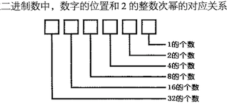
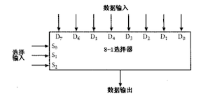

# 编码-隐藏在计算机软硬件背后的语言-笔记

## 一、 编码的发展进程

#### (一)莫尔斯编码

1. 莫尔斯编码是由塞缪尔.莫尔斯发明的（1791-1872年），跟随电报机的问世而发明。

   

2. 解码图表：

   

3. 莫尔斯码也被称作二进制码，其组合元素只有两个“点”和“划”。

4. 摩斯码的编码规则

   1. **划的长度等于点的长度的三倍；**
   2. **单个字母内，点和划之间以长度与点相等的空格来分开；**
   3. **单词内的各个字母之间用长度与划相等的空格来分隔；**
   4. **各单词之间用长度等于两倍划的空格来分开。**

#### (二)布莱叶盲文与二进制编码

1. 生于法国的路易斯.布莱叶（1809–1852年，）第一个将书面语言的字母进行编码的人。

#### (三)手电筒剖析

1. 一个简单的电路：电源、导线、电灯、开关。
2. 电流是电子的运动而产生。（电子理论）
   1. 电路中的电子由一个原子移动到下一个原子，就形成了电流。
   2. 电流与流经电路的电子数有关。

#### (四)通信

1. 电报机（莫尔斯发明）：电报机标志着现代通信的开始。（1836--1844）
2. 继电器。（美国科学家[约瑟夫·亨利]1831--1837发明）

-----

## 二、数字

#### (一)数字系统

1. 罗马数字

   1. 现在还在沿用的数字有：I、V、X、L、C、D、M（分别是：1、5、10、50、100、500、1000）。

2. 阿拉伯数字，位置计数系统：

   1. （1、2、3、4、5、6、7、8、9、0）。

   1. 数字的大小与位置有关，都可以用10的整数次幂来表示。
   2. 用0来表示站位符。

3. 数字系统

   1. 十进制，以十为底的数字系统。

   

   2. 八进制，以八为底的数字系统。

   

   3. 二进制，以二为底的数字系统。

      ​	

#### (二)二进制数

1. 比特：组成信息快的基本单位。
   1. 比特是数字；
   2. 比特位数越多，所表示的不同可能性就越多。
   3. 2的整数次幂，幂指数就是比特位的位数。
2. 每增加一个比特位数就会将编码的数量**增加一倍**。

#### (三)逻辑与开关

1. 逻辑：是在人们追求真理的过程中的一种分析方法。

<!--亚里士多德的逻辑学基础是三段论法：大前提、小前提、结论-->

1. 布尔代数（乔治.布尔，1815--1864）
   1. 操作数不是数字而是类；
   2. 一个类就是一个事物的群体，也被称为"**集合**"。
2. 布尔代数中的符号”+“和”x”
   1. 符号"+"表示两个集合的并集；
   2. 符号"x"表示两个集合的交集；
   3. 避免混淆，有时用"**∨**"和“**∧**”表示。

3. 布尔代数公式表

   1. 符号“+”现在可以用OR来表示；
   2. 符号“x”现在可以用AND来表示；
   3. 符号“1 - ”现在用NOT来表示；
   4. 用“0”表示NO，用“1”表示Yes；

   

#### (四)门-布尔代数在电路中的运用

1. 通信的数学原理：贡献人克洛德.艾尔伍德.香农。

   <!--香农的论文题目《继电器与开关电路的符号分析》-->

2. 继电器像开关一样，可以串联或并联在电路中执行简单的逻辑任务，这种继电器的**组合**叫做“**逻辑门**”。逻辑门通常有两个或多个输出。

3. 逻辑中的或门

   1. 或门：

​	2. 或门状态组合符：

<!--或门（或逻辑）：A、B、C只要有一个条件满足时，事件Y就发生-->

1. 逻辑门中的"**与门**"：两个继电器的串联
   1. 与门原始图：

​	2. 与门简化图：

<!--与门（与逻辑）：只有条件同事满足时，事件Y才发生，即只有输入端都为1的状态下，输出才为1-->

5. 反向器：开关闭合，灯泡熄灭；这样连接的继电器叫做反向器；反向器能将0（低电平）转换为1（高电平）。因此被称为反向器。

   <!--反向器本质是一个继电器，反向器不是逻辑门，逻辑门通常有两个或多个输入。-->

   

   反向器的符号：

   

6. **或非门**简称“NOR”：

   1. 或非门电路图
   2. 

​	3**. 或非门的特点是：当两端输入都没有电压时，才产生电压。（即两端输入为0，0时，输出为1）**

7. **与非门**简称“NAMD”：

8. 摩根定律：简化布尔代数的一种定律。

   

----

## 三、二进制

#### (一)二进制加减法

1. 二进制加法表

   

2. 二进制进为表

   

3. 二进制加法进位与逻辑门中的与门输出结果一样。加法表与逻辑门中的或门输出结果一样。

4. 二进制减法，规则：
   1. 在二进制中减法中，减数是从一串1中减去的，结果为1的补数。
   2. 在求1的补数时，只需要将原来二进制数中的1变为0，将0变为1即可。
   3. 因此，对1求补数有时候也被称为**相反数**或**反码**。

#### (二)反馈与触发器

1. 我们把这种电路称为"**振荡器**"：

​	1. 简化图：

​	2. 电路图解释：当输入为0时，它的输出就为1；当输入为1时，它的输出就为0；电路中的开关一旦闭合，反向器中的继电器就会在连通与断开这两种状态之间反复交替。省去开关，就可以使反向器自发的连续的工作。

2. **振荡器又被称为时钟**：随着时间推移，振荡器的输出在0和1之间有规律的交替变化。

3. 振荡器的周期（循环）：振荡器从某个初始状态开始，经过一段时间又回到先前的初始状态的这一段间隔定义为振荡器的一个循环，或称为一个周期。

4. 频率：

   

   1. 一个循环所占用的时间就是改振荡器的周期；
   2. 周期的倒数就是震荡器的频率；

5. **<u>反馈</u>**--特殊连接的电路：两个或非门、两个开关和一个灯泡的电路

​	<!--在电路中，左边或非门的输出是右边或非门的输入，而右边或非门的输出是左边或非门的输入，这种连接方式成为”反馈“-->

 1. 1. 电路状态：

       只闭合上面开关，灯亮，断开上面开关，灯依然亮；

       只闭合下面开关，灯熄，断开下面开关，灯熄；

    <!--在此电路中，当两个开关都断开时，电路有两个稳定状态，这类电路被称为”触发器“-->

    2. **或非门的特点是：当两端输入都没有电压时，才产生电压。（即两端输入为0，0时，输出为1）**

6. 触发器（1918发明）：触发器电路可以保持信息，它可以记住某些信息。

   1. R-S(Reset-Set ，复位/置位)触发器:

      

   2. 用Q和Q反来表示灯泡的输出的状态，Q表示0，Q反表示1；

   3. 真值表/功能表/逻辑表：

   

7. 锁存器：在这样一种电路中，写操作端为0时，数据输入信号的状态与输出无影响；如果想将数据输入信号存储在触发器中时，可以把写操作端先置为1后置为0；    

8. 电平触发的D型锁存器：

   

   <!--电平触发：指的是保持为输出为某一特定电平(0或1)时，触发器保存数据端的输入值-->

9. D型锁存器功能表：

#### (三)字节与十六进制

1. 比特与字节
   1. 八比特等于一字节。

2. 十六进制、八进制、二进制、十进制的换算

---

## 三、存储器

#### (一)存储器的作用

1. 存储器的作用：保障存储和访问（输出）这两个过程之间的信息完好无损。保存信息。

#### (二)存储器的演变发展

1.  在D型锁存器的基础上，将输入和输入以及保持位（或叫时钟输入端）端重新命名，依次为：数据输入端、数据输出端、写操作端。

2. 一位锁存器：保存1个比特信息。

   1. 电路图：

      

   2. 简化图：

   

3. 8位锁存器：保存8个比特信息

   1. 详图

   

   2. 简略图

   

3. 在8位锁存器上加入选择器

   1. 8-1选择输入器图

   

   2. 选择器的作用：进行8选1操作，输出相应锁存器的数据。选择输入端的功能：选择一个输入端数据，然后使其在输出端输出。  

   <!--此选择器的输入端包括了写操作信号以及数据输入信号，所有的数据输入信号在锁存器的输入端可以连接在一起，写入信号不能够连接，考虑到向每个锁存器依次写入数据，就必须加入一个独立的写入信号。-->

4. 3-8译码器：独立写入信号

   1. 图示

   

   2. 译码器的作用：能被路由到任意（且唯一）的锁存器上。

      <!--注意：任何时刻，译码器的只会有一个锁存器的输出为1，其余均为0.-->

5. 随机访问存储器（RAM）

   1. 存储器结构：一个3-8译码器、一个8-1选择器、和八个1位锁存器组成。

   

   2. 8位存储器简图：

   

6. 地址端口：译码器和选择器具有相同的选择信号，这三个信号一起被称为”地址端口“。

   地址端口的作用：在译码器的输入端，地址决定了哪些锁存器可以被写操作端的信号触发来保存数据；在选择器的输入端，选择器通过地址选择锁存器中的一个，将其输出。

7. RAM阵列：将RAM进行特殊的配置可以形成RAM阵列。阵列以1比特为存储单位，共存储8个单位的数据。

8. 共享地址型阵列 

   实例8x2RAM阵列：可存储的二进制数任然是8个，但每个数的位宽为2位。

   

9. 实例16X1RAM阵列:存储容量为16个单位，每个单位占1位。

10. RAM阵列的存储量：

    RAM阵列的存储容量 = 2^地址输入端的个数

11. 

一

