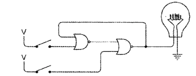
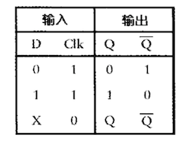

# 编码-隐藏在计算机软硬件背后的语言-笔记

## 一、 编码的发展进程

#### (一)莫尔斯编码

1. 莫尔斯编码是由塞缪尔.莫尔斯发明的（1791-1872年），跟随电报机的问世而发明。

   

2. 解码图表：

   

3. 莫尔斯码也被称作二进制码，其组合元素只有两个“点”和“划”。

4. 摩斯码的编码规则

   1. **划的长度等于点的长度的三倍；**
   2. **单个字母内，点和划之间以长度与点相等的空格来分开；**
   3. **单词内的各个字母之间用长度与划相等的空格来分隔；**
   4. **各单词之间用长度等于两倍划的空格来分开。**

#### (二)布莱叶盲文与二进制编码

1. 生于法国的路易斯.布莱叶（1809–1852年，）第一个将书面语言的字母进行编码的人。

#### (三)手电筒剖析

1. 一个简单的电路：电源、导线、电灯、开关。
2. 电流是电子的运动而产生。（电子理论）
   1. 电路中的电子由一个原子移动到下一个原子，就形成了电流。
   2. 电流与流经电路的电子数有关。

#### (四)通信

1. 电报机（莫尔斯发明）：电报机标志着现代通信的开始。（1836--1844）
2. 继电器。（美国科学家[约瑟夫·亨利]1831--1837发明）

-----

## 二、数字

#### (一)数字系统

1. 罗马数字

   1. 现在还在沿用的数字有：I、V、X、L、C、D、M（分别是：1、5、10、50、100、500、1000）。

2. 阿拉伯数字，位置计数系统：

   1. （1、2、3、4、5、6、7、8、9、0）。

   1. 数字的大小与位置有关，都可以用10的整数次幂来表示。
   2. 用0来表示站位符。

3. 数字系统

   1. 十进制，以十为底的数字系统。

   

   2. 八进制，以八为底的数字系统。

   

   3. 二进制，以二为底的数字系统。

      ​	

#### (二)二进制数

1. 比特：组成信息快的基本单位。
   1. 比特是数字；
   2. 比特位数越多，所表示的不同可能性就越多。
   3. 2的整数次幂，幂指数就是比特位的位数。
2. 每增加一个比特位数就会将编码的数量**增加一倍**。

#### (三)逻辑与开关

1. 逻辑：是在人们追求真理的过程中的一种分析方法。

<!--亚里士多德的逻辑学基础是三段论法：大前提、小前提、结论-->

1. 布尔代数（乔治.布尔，1815--1864）
   1. 操作数不是数字而是类；
   2. 一个类就是一个事物的群体，也被称为"**集合**"。
2. 布尔代数中的符号”+“和”x”
   1. 符号"+"表示两个集合的并集；
   2. 符号"x"表示两个集合的交集；
   3. 避免混淆，有时用"**∨**"和“**∧**”表示。

3. 布尔代数公式表

   1. 符号“+”现在可以用OR来表示；
   2. 符号“x”现在可以用AND来表示；
   3. 符号“1 - ”现在用NOT来表示；
   4. 用“0”表示NO，用“1”表示Yes；

   

#### (四)门-布尔代数在电路中的运用

1. 通信的数学原理：贡献人克洛德.艾尔伍德.香农。

   <!--香农的论文题目《继电器与开关电路的符号分析》-->

2. 继电器像开关一样，可以串联或并联在电路中执行简单的逻辑任务，这种继电器的**组合**叫做“**逻辑门**”。逻辑门通常有两个或多个输出。

3. 逻辑中的或门

   1. 或门：

​	2. 或门状态组合符：

<!--或门（或逻辑）：A、B、C只要有一个条件满足时，事件Y就发生-->

1. 逻辑门中的"**与门**"：两个继电器的串联
   1. 与门原始图：

​	2. 与门简化图：

<!--与门（与逻辑）：只有条件同事满足时，事件Y才发生，即只有输入端都为1的状态下，输出才为1-->

5. 反向器：开关闭合，灯泡熄灭；这样连接的继电器叫做反向器；反向器能将0（低电平）转换为1（高电平）。因此被称为反向器。

   <!--反向器本质是一个继电器，反向器不是逻辑门，逻辑门通常有两个或多个输入。-->

   

   反向器的符号：

   

6. **或非门**简称“NOR”：

   1. 或非门电路图
   2. 

​	3**. 或非门的特点是：当两端输入都没有电压时，才产生电压。（即两端输入为0，0时，输出为1）**

7. **与非门**简称“NAMD”：

8. 摩根定律：简化布尔代数的一种定律。

   

----

## 三、二进制

#### (一)二进制加减法

1. 二进制加法表

   

2. 二进制进为表

   

3. 二进制加法进位与逻辑门中的与门输出结果一样。加法表与逻辑门中的或门输出结果一样。

4. 二进制减法，规则：
   1. 在二进制中减法中，减数是从一串1中减去的，结果为1的补数。
   2. 在求1的补数时，只需要将原来二进制数中的1变为0，将0变为1即可。
   3. 因此，对1求补数有时候也被称为**相反数**或**反码**。

#### (二)反馈与触发器

1. 我们把这种电路称为"**振荡器**"：

​	1. 简化图：

​	2. 电路图解释：当输入为0时，它的输出就为1；当输入为1时，它的输出就为0；电路中的开关一旦闭合，反向器中的继电器就会在连通与断开这两种状态之间反复交替。省去开关，就可以使反向器自发的连续的工作。

2. **振荡器又被称为时钟**：随着时间推移，振荡器的输出在0和1之间有规律的交替变化。

3. 振荡器的周期（循环）：振荡器从某个初始状态开始，经过一段时间又回到先前的初始状态的这一段间隔定义为振荡器的一个循环，或称为一个周期。

4. 频率：

   

   1. 一个循环所占用的时间就是改振荡器的周期；
   2. 周期的倒数就是震荡器的频率；

5. **<u>反馈</u>**--特殊连接的电路：两个或非门、两个开关和一个灯泡的电路

​	<!--在电路中，左边或非门的输出是右边或非门的输入，而右边或非门的输出是左边或非门的输入，这种连接方式成为”反馈“-->

 1. 1. 电路状态：

       只闭合上面开关，灯亮，断开上面开关，灯依然亮；

       只闭合下面开关，灯熄，断开下面开关，灯熄；

    <!--在此电路中，当两个开关都断开时，电路有两个稳定状态，这类电路被称为”触发器“-->

    2. **或非门的特点是：当两端输入都没有电压时，才产生电压。（即两端输入为0，0时，输出为1）**

6. 触发器（1918发明）：触发器电路可以保持信息，它可以记住某些信息。

   1. R-S(Reset-Set ，复位/置位)触发器:

      

   2. 用Q和Q反来表示灯泡的输出的状态，Q表示0，Q反表示1；

   3. 真值表/功能表/逻辑表：

   

7. 锁存器：在这样一种电路中，写操作端为0时，数据输入信号的状态与输出无影响；如果想将数据输入信号存储在触发器中时，可以把写操作端先置为1后置为0；    

8. 电平触发的D型锁存器：

   

   <!--电平触发：指的是保持为输出为某一特定电平(0或1)时，触发器保存数据端的输入值-->

9. D型锁存器功能表：

#### (三)字节与十六进制

1. 比特与字节
   1. 八比特等于一字节。

2. 十六进制、八进制、二进制、十进制的换算

---

## 三、存储器

#### (一)存储器的作用

1. 存储器的作用：保障存储和访问（输出）这两个过程之间的信息完好无损。保存信息。

#### (二)存储器的演变发展

1.  在D型锁存器的基础上，将输入和输入以及保持位（或叫时钟输入端）端重新命名，依次为：数据输入端、数据输出端、写操作端。

2. 一位锁存器：保存1个比特信息。

   1. 电路图：

      

   2. 简化图：

   

3. 8位锁存器：保存8个比特信息

   1. 详图

   

   2. 简略图

   

3. 在8位锁存器上加入选择器

   1. 8-1选择输入器图

   

   2. 选择器的作用：进行8选1操作，输出相应锁存器的数据。选择输入端的功能：选择一个输入端数据，然后使其在输出端输出。  

   <!--此选择器的输入端包括了写操作信号以及数据输入信号，所有的数据输入信号在锁存器的输入端可以连接在一起，写入信号不能够连接，考虑到向每个锁存器依次写入数据，就必须加入一个独立的写入信号。-->

4. 3-8译码器：独立写入信号

   1. 图示

   

   2. 译码器的作用：能被路由到任意（且唯一）的锁存器上。

      <!--注意：任何时刻，译码器的只会有一个锁存器的输出为1，其余均为0.-->

5. **随机访问存储器（RAM）**

   1. 存储器结构：一个3-8译码器、一个8-1选择器、和八个1位锁存器组成。

   

   2. 8位存储器简图：

   

6. 地址端口：译码器和选择器具有相同的选择信号，这三个信号一起被称为”地址端口“。

   地址端口的作用：在译码器的输入端，地址决定了哪些锁存器可以被写操作端的信号触发来保存数据；在选择器的输入端，选择器通过地址选择锁存器中的一个，将其输出。

7. RAM阵列：将RAM进行特殊的配置可以形成RAM阵列。阵列以1比特为存储单位，共存储8个单位的数据。

8. 共享地址型阵列 

   实例8x2RAM阵列：可存储的二进制数任然是8个，但每个数的位宽为2位。

   

9. 实例16X1RAM阵列:存储容量为16个单位，每个单位占1位。

10. RAM阵列的存储量：

    RAM阵列的存储容量 = 2^地址输入端的个数

11. **1024X8阵列**可存储8192个比特信息。存储容量为1024个单位，每个单位占8位。

    1. 图示：

    

    2. 此阵列的存储容量为1024字节，等于1KB。

12. 随机访问存储器的缺点：断掉电源，数据丢失。随机范访问存储器也被称为易失性存储器。易失性存储器需要稳定的电源。

---

## 四、自动操作

#### (一)累加器

1. 累加器定义：用来累加多个数的锁存器称作累加器。宽度
2. 进位锁存器：保存低字节数运算的进位输出。 

#### (二)操作码

1. 操作码：指示电路下一步要执行的某种操作。

   常规操作码：Load（加载）、Store(保存)、Add(加法)、Halt(停止)、Jump(跳转)、、、、

2. 计算机和计算器的区别：能否控制重复操作或循环。

3. 机器码助记符：

   

#### (三)加法器的演变

1. 简单二进制加法器组成：开关、灯泡以及各种形式连接起来的逻辑门组成的。

   1. 8位加法器计算范围：二进制数（0000~0000到1111~1111）；十进制范围（0~255）；
   2. 两个8位二进制的和最大可能为1-1111-1110，即510； 

2. 半加器组成：一个异或门给加法为结果输出；一个与门给进位结果输出；

   1. 一个半加器计算能力为两个二进制数相加；
   2. 半加器的组成原理：将两个二进制数相加，得到一个加法位和一个进位位。
   3. 半加器的简图：

   

   

3. 全加器：由两个半加器和一个或门组成。

   1. 对多个二进制数进行加法运算。
   2. 工作原理：

   首先，第一个半加器输入A、B，输出一个加和及相应的进位。

   1. 全加器简图：

   

4. 8位加法器：由8个全加器组成；每个全加器的进位输出都作为下一个全加器的进位输入。16位加法器：由2个8位加法器构成。

   

5. 减法器：组成结构与加法器相似，在加法器的基础上添加了一个**求补器**，以及一个异或门的减法选择器。
   1. 求补器的组成：由8个异或门（取反器）合并拼起来的组成“**求补器**”。
   2. 求补器的作用：对1求补数，也就是取反。

6. 实现连加功能

   1. 添加实现连加，保存数据的结构：8位锁存器。
   2. 增加保存数据的结构：2-1选择器。选择第二排数据的输入是第一次加法运算保存在锁存器中和，还是直接输入数据。 

7. 清零结构：添加原因是因无法精确控制输入信息。

   1. 清零结构的组成：在D型触发器上进行修改，添加一个或门输入信号（清零）。
   2. 清理结构原理：清零信号通常为0，当它为1时，Q端输出为0；清零信号总是强制Q端输出为0，达到清零目的。
   3. 加法器工作原理：按下清零开关，使Q为0，8位加法器的第二排输入为0；通过开关输入第一个数，在按下“相加”开关，再输入第二个加数并在次闭合相加开关，连续反复，进行多次加运算。
   4. 结构图：

   

8. 完整加法器：加入震荡器，控制RAM的存储；加入RAM阵列，保存所有加减法运算时的数据输入以及运算结果；加入16位计数器，控制RAM阵列的地址信号，方便写入、取出以及修改数据信息。

   1. 计算器简图

   
   2. 进行自动加法操作：把一个字节从RAM阵列中传送到累加器中，这样的操作称作"**加载**"；

   3. 把累加器中的数据取出并放入到存储器中，

   4. 增加将自动加法器停下的操作； 

9. 零锁存器：零转移指令与非零转移指令，跳转到指定地址。

10. 软件：输入存储器中数据和指令称作软件；

    硬件：看得见的，摸得着的，例如电线，开关等称作硬件；

-----

## 五、处理器

#### (一)微型处理器

1. 诞生时间：1971年，第一个微型处理器：Intel4004
   1. 英特尔 8080处理器	
   2. 摩托罗拉  6800处理器
   3. 德克萨斯仪器设备公司 4位处理器TMS1000，用于计算器、玩具和设备
   4. 国家半导体公司PACE—首个16位微处理器
2. 8080与6800比较
   1. 8080是一个8位微处理器，寻址空间为64KB，时钟频率为2MHZ，6000个晶体管。
   2. 6800的寻址空间也是64KB，4800个晶体管。
   3. 两者都是40个管脚的集成电路。
   4. 8080的特殊之处是它需要三种电压。   

3. 微处理器通常有多个用来寻址存储器的输出信号。用于寻址的输出信号数目与微处理器的可寻址空间大小直接相关。
   1. 例如：8080有16个用于寻址的输出信号，它的可寻址空间数位2^16，即65536。  

#### (二)指令

1. 读写数据功能：将8080微处理器连接到一个64KB的存储器，独立的读写数据。
2. 8080芯片复位后，将锁存在存储器0000h地址处的字节读入微处理器，通过地址信号端实现该过程，它读取的字节必须是8080指令，读取该字节的过程被称为”取指令“。
3. 指令的字节：8080中，指令的长度可以是1字节、也可以是2字节，或3字节.
4. 8080芯片微处理器的内部除了累加器外还设置了6个寄存器，每个寄存器可以存放一个8位的数。寄存器和累加器一样，本质上都是锁存器。处理器既可以把数据读入寄存器，也可以把数据从寄存器存回存储器。

5. 寄存器对：通常把两个8位的寄存器H和L合起来构成一个16位的**寄存器对**，称作HL，H用来保存高字节L用来保存低字节。这个16位的值通常用来对存储器寻址。
6. 8080的**标志位**：符号标志位SF，奇偶标志位PF和辅助进位标志位AF。在8080中有一个专门的8位寄存器用来存放标志位，该寄存器称为程序状态字。
7. 8080中的4个**循环移位指令**，这些指令可以把累加器中的内容向左或向右移动一位。

#### (三)存储器

1. **随机访问存储器**：微处理器可以寻址访问的存储器称为随机访问存储器。
2. 从底部到顶部的顺序把数据存入到堆栈中，以相反的顺序将数据取出，这种形式的存储器称为堆栈，又称作后进先出存储器（LIFO）。堆栈的特点是：最先保存到堆栈中的数据最后取出，最后保存的数据最先被取出。
3. 通常把数据存入堆栈的过程称为压入（push），把从堆栈中取出的数据的过程称作弹出（pop）。

4. 堆栈功能的实现：堆栈其实就是一段普通的RAM存储空间，只是这段空间相对独立不另作他用。8080微处理器设置了一个专门的16位寄存器对这段空间寻址，这个特殊的寄存器称为**堆栈指针**。

5. 堆栈错误：每执行一条PUSH指令，堆栈都会增加两个字节，会导致错误：堆栈不断增大，最终覆盖掉存储器中保存的程序所必须的代码或数据。这种错误被称作**堆栈上溢**。过多使用POP指令，则会过早的取完堆栈中的数据从而导致错误，这种错误被称作**堆栈下溢**。

6. 堆栈存储：将堆栈指针初始化为0000h，当执行完第一条PUSH指令时，堆栈指针会减1变为FFFFh，即存储器的最后一个存储单元。这时堆栈的初始位置将会是存储器的最高地址，因为程序的代码通常从0000h开始存放，因此两者保持非常远的距离。

----

## 六、操作系统

#### (一)总线

1. 总线：计算中各部件按照功能被分别安装在两个或更多的电路板上，这些电路板之间通过总线通信。总线就是这些数字信号的集合。这些信号被提供给计算机上的每块电路板。
2. 大致分成4种信号：
   1. 地址信号
   2. 数据输出信号
   3. 数据输入信号
   4. 控制信号
3. 总线还可以为电路板提供电源。

#### (二)操作系统

1. 理解机器代码如何加载到内存地址中的
2. 软件安装到新计算机中的过程
3. 键盘处理程序：其内部含有一个命令处理程序，可以解释三条命令，分别是W命令，此命令把字节写入到内存中，键盘处理程序将ASCII码转换成字节；D命令，此命令把内存中的字节显示出来；R命令，此命令表示运行；
4. 解决断电信息丢失问题：
   1. ROM芯片：它包含了ASCII码字符显示到视频显示器上所需要的全部点阵模式。
   2. 磁盘：将命令处理程序存储到ROM后，就可以执行操作：把内存中的数据写入到磁盘中，然后再把数据读回到内存中。
   3. 磁盘不会因断电而丢失数据。
5. 解决数据保存在磁盘中的位置问题:
   1. 文件系统：是磁盘存储的一种方法，就是把数据组织成文件，文件是相关数据的集合，占用磁盘上的一个或多个扇区；
   2. 可以给文件命名。
6. 操作系统是许多软件构成的庞大程序集合，文件系统是其中的一部分。
7. CP/M8位微处理操作系统：存放在磁盘上，存放在磁盘最开始的两个磁道。CP/M在磁盘上不能运行，必须加载到内存里。
8. CP/M的三个主要组成部分：控制台（键盘和显示器组成了控制台）命令处理程序、基本磁盘操作系统、基本输入/输出系统。
9. 操作系统提供的主要功能之一是让程序能够方便的访问计算机的硬件，操作系统提供的这样的访问操作称为API，应用程序接口。
10. API是一个与设备无关的接口，它屏蔽了硬件之间的差异，从而实现了跨平台。
11. **UNIX系统**：使用UNIX系统的计算机通过时分复用技术——这种技术允许多个用户同时与计算机进行交互——来达到多个人同时使用一台计算机的目的。
    1. 计算机连接多个配置了显示器和键盘的终端，每个用户通过这些终端访问计算机，通过在所有终端间的快速切换，同时在为多个用户服务。
    2. 在一个操作系统上同时允许多个程序，称为“多任务操作系统”。
12. 为了解决多道程序并行运行时所用到的大量内存问题，操作系统引入了“虚拟内存”技术。
    1. 虚拟内存：在磁盘上划出部分空间用做保存临时文件，程序把暂时不需要用的内存块放到临时文件里，待需要时再把它调入内存中。  

#### (三)定点数和浮点数

1. 二进制存储负数：
   1. 使用BCD（二进制编码的十进制数）：两个BCD数字存放在一个字节。
   2. 最左边的半字节所构成的1表示数字为负数，最左边的半边字节所构成的数字为0表示正数。
2. 定点格式：定点是指小数点的位置总是在数的某个特定位置。
3. 浮点格式：浮点式是指基于科学计数法的，是存储数较大或极小数的理想方式。

4. 规范化浮点数：小数点的左边通常只有一个1。
   1. 单精度浮点数：4个字节，32位，相当于十进制的7位。
   2. 双精度浮点数：8字节，64位，相当于十进制的16位。

