# 计算机是怎么跑起来的 - 笔记

### 一、计算机基础（基础）

#### 1. 计算机的三大原则

1. 计算机是执行输入、运算、输出的机器。
2. 程序是指令和数据的集合。
3. 计算机的处理方式与人脑的处理方式不同。

4. 程序中的数据：
   1. 作为指令执行对象的输入数据。
   2. 作为指令执行结果的输出数据。

 <!-- 总结：计算机是执行指令的机器，程序是指令和数据的集合。所有信息都可以用数字表示，这是计算机的特性之一。 计算机会把所有的数据都用数字表示 。-->

#### 2. 计算机硬件的三个基本要素：CPU、内存、I/O

1. **CPU**处理器：

   1. **CPU：中央处理器，负责解释、执行程序。从内存或 I/O 输入数据，在内部进行运算，再把运算结果输出到内存或 I/O。**
   2. CPU的种类。
   3. 时钟信号频率：由时钟发生器发送给CPU的电信号的频率，单位是MHZ(兆赫兹)。
   4. ***CPU中的寄存器：能存储数据，并对数据进行运算。***PC寄存器，负责存储内存地址，该地址指向下一条即将执行的指令。

2. 内存（IC，集成电路）

   1. 内存中存放程序。
   2. 地址空间：每个地址都标示着一个内存中的数据存储单元，而这些地址所构成的范围就是内存的地址空间。地址功能：在内存中，每个地址的功能都一样，既可用于存储指令又可用于存储数据。
   3. 每个地址空间可以存储多少比特的信息。

3. I/O

   1. **I/O 中临时存放着用于与周边设备进行输入输出的数据。**
   2. I/O的种类：就是指连接着微型计算机和周边设备的 I/O的种类。
   3. 地址空间：是指用于指定 I/O 寄存器的地址范围地址功能：地址编号不同(即寄存器的类型不同)，功
      能也就不同。
   4. 连接的周边设备。

4. 汇编语言

   1. 语法：标签（代表地址）、操作码（指令）、操作数（指令对象）并排一行。
      1. 标签的作用是为该行代码对应的内存地址起一个名字。
      2. 操作码：按功能划分为：运算、与内存输入输出以及I/O输入输出。
      3. 操作数（表示指令执行的对象）：CPU的寄存器、内存地址、I/O地址等。
   2. 汇编语言使用十进制数和十六进制数记录数据。
   3. 助记符的使用。

5. 机器语言

   1. 由二进制数构成的原生代码。**CPU能直接理解的一种编程语言。**

-----

### 二、编程基础（程序设计）

#### 1.流程图

​	三种流程：顺序执行、条件分支、循环流程。

1. 顺序执行：按照指令记录的先后顺序依次执行的一种流程。（基本流程）
2. 条件分支：根据若干条件的成立如否，在程序的流程中产生若干分支的一种流程。
3. 循环流程：在程序的特定范围内反复执行若干次的一种流程。
4. 中断处理：这指的是在计算机使程序的流程突然跳转到程序的特定地方（中断处理例程或中断处理程序）。计算机具有硬件上处理中断的能力。（interrupt）
5. 事件驱动：把用户在应用程序中点击鼠标或者敲击键盘这样的行为成为“事件”。应用程序根据事件的类型做出相应的处理。这样的机制成为事件驱动。

实例：剪刀石头布游戏流程图

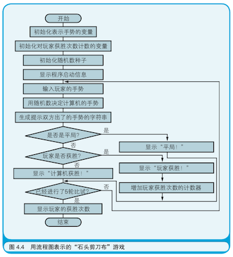

#### 2、算法（处理问题的步骤）

1.  算法定义：被明确定义的有限个规则的集合，用于根据有限的步骤解决问题。（输入数值、执行运算、输出结果）

2. 哨兵：用于线性搜索（从若干个数据中查找目标数据）等算法中。

3. 主要典型算法。

   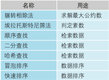

使用哨兵的流程图示例：

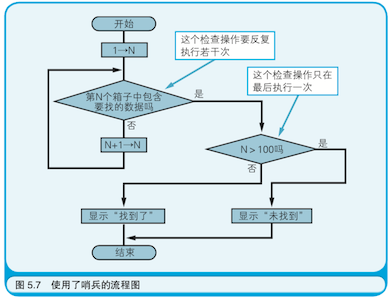

#### 3、数据结构（处理对象的数据排列方式）

1. 数据结构基础：数组。
   1. 数组是一种直接利用内存物理结构（计算机特性）的最基本的数据结构。
   2. 数组实际上是为了存储多个数据而在内存上集中分配出的一块特定大小的内存空间，并且为这块内存空间整体赋予了一个名字。

2. 变量，是数据的容器，是程序中数据存储的最小单位。

3. 典型数据结构:

   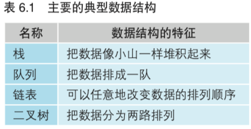

   a.栈的实现：一个数组，一个变量（栈顶指针），两个函数（入栈函数、出栈函数）。

   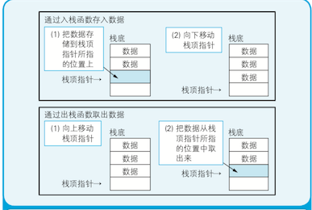

   b. 队列的实现：一个数组，两个变量，两个函数。

   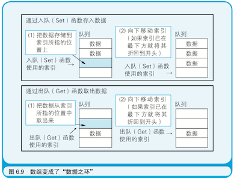

4. 结构体：就是把若干个数据项汇集到一处，并赋予其名字后所形成的一个整体。

5. 链表结构

   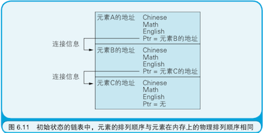

6. 二叉树结构：

   ​	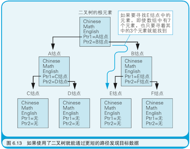

#### 4、面向对象编程	

1. 对象（object）：表示事物的抽象名词。

2. 面向对象编程含义

   面向对象编程(OOP，Object Oriented Programming)是一种**编写程序的方法**，旨在提升开发大型程序的效率，使程序易于维护 。

3. 什么是类？

   1.  把程序中有关联的函数和变量汇集到一起编成组，这个组就是类。
   2.  通常将汇集到类中的函数和变量统称为“成员”。
   3. **类就是程序的组件。**通过把若干个类**组装**到一起构建一个完整的程序。

4. 类和对象的区别？

   类是对象的定义，对象是类的实例。  也可以说：类是做饼干的模具，用模具做出来的饼干是对象。

5. 主要编程技巧：继承、封装、多态（多样性或多义性）

   1. 继承：指的是通过继承已存在的类所拥有的成员而生成新的类。
   2. 封装：指的是在类所拥有的成员中，隐藏掉那些没有必要展现给该调用者的成员。
   3. 多态：指同一种消息，不同对象可以进行不同的操作。

6. 类的三种使用方法：

   1.  仅调用类所持有的个别成员（函数和变量）。
   2. 在类的定义中包含其他类（称作组合）。 
   3. 通过继承已存在的类定义出新的类。

7. 消息传递：

   程序可以通过由一个对象去调用另一个对象所拥有的函数这种方式运行起来，这种方式被称为对象间的消息传递。

8. 框架是什么

   1.  通过隐藏操作系统的复杂性从而提升开发效率的程序集，这种程序集被称为**框架**。
   2.  框架一般由两部分组成：执行引擎，类库。

   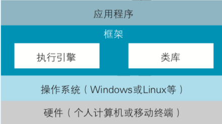

#### 5、数据库

1. 数据库是什么

   1. 数据库就是数据的基地。
   2. 数据库的主要类型是关系型数据库。

2. D BMS是Database Management System(**数据库**管理系统)的简称.

3. **数据管理**系统的构成三要素：数据文件、DBMS、应用程序。

   1. DBMS可以使应用程序轻松地读写数据文件，而且还具有一致并且安全地存储数据的功能。
   2. 三要素在小型系统中，被称为“独立型系统”；中型系统中，被称为“文件共享型系统”；大型系统中，被称为“客户端/服务器型系统”。

   <!--其中部署数据文件和DBMS的计算机，是服务器；部署应用程序的计算机是客户端-->

4. web系统：将服务器和客户端之间通过互联网联结起来，就形成了**web**系统。

   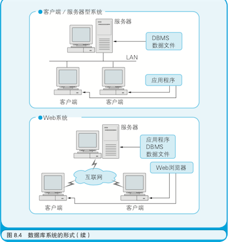

5. 数据库术语

   1. 把录入到表中的每一行数据都成为**记录**（也被称为行或元组）；
   2. 把构成每一条记录中的各个数据项所在列都成为**字段**（也被称为列或属性）;

6. 如何整理数据系统结构？

   （ **表(Table)**就是被整理成表格形式的**数据**。）

   1. 规范化，即将一张大表分割成多张小表，然后在小表之间建立关系，以达到整理数据库结构的目的。
   2.  规范化，避免重复存储相同数据。通过规范化，可以形成结构更加优良的数据库。

7. 如何在表与表之间建立联系？

   1. 用主键和外键建立表之间的联系。
   2. 主键，存储的是能够唯一标识一条记录的ID，在主键上绝对不能存储相同的值。
   3. 连接表：出现多对多关系时，可以在这两张表之间再加入一张表，把多对多关系分解成两个一对多关系，此表被称为连接表。

8. 对数据库进行CRUD操作

   1. CRUD：指的是记录的插入（CREATE）、获取（REFER）、更新（CPUATE）、删除（DELETE）。
   2. 对数据库进行CRUD操作，就必须从应用程序向 DBMS 发送命令，这种命令所使用的语言就是**SQL**语言（**结构化查询语言**）。

9. DBMS的功能

   1. 自动生成主键和外键；
   2.  在表的各个字段上设置索引；
   3. 提供可视化的工具；
   4. 提供手工输入数据的工具；
   5. 检查参照完整性的功能；
   6. 高级功能：事务控制；

   <!--事务：事务由若干条SQL 语句构成，表示对数据库一系列相关操作的集合。-->

----

### 三、网络

#### 1、IP/TCP网络

1. 网络是什么？

   人们把通过连接多台计算机所组成的、可用于交换信息的系统称为“网络”。

2. LAN（Local Area Network）局域网的缩写。WAN（Wide Area Network）广域网的缩写。

3. TCP/IP （Transmission Cotrol Protol/ Internet Protocol）传输控制协议和网际协议的缩略语。

4. 路由器

   1. 路由器是把公司内的网络和互联网连接起来的设备，是 **数据的指路人** ；
   2. 路由器是决定数据传输路径的设备；
   3. 路由器的工作原理，查看附加到数据上的IP地址中的网络地址部分；
   4. 把数据经过路由器转发的过程称为“路由”；

5. 什么是IP地址？什么是MAC地址？
   1. 每台计算机设定一个软件上的编号，这个编号就是IP地址（由主机地址和网络地址组成）；（计算机软件）
   2. MAC地址就是能够表示网卡的编号（由厂商的编号和产品的编号组成）；（计算机硬件）

6. IP地址与MAC地址的对应关系？

    IP地址使用起来比较麻烦，MAC地址是能够标识作为数据最终接收者的网卡，通过ARP（地址解析协议）将IP地址转成MAC地址。 

7. IP协议与TCP协议
   1.  IP协议用于指定数据发送目的地的IP地址以及通过路由器转发数据；
   2.  TCP协议用于通过数据发送者和接收者相互回应对方发送来的确认信号，可靠地传输数据；

#### 2、数据加密

1. 计算机把所有的数据都用数字表示，因此对此加密的技术基本相同。

2. 明文，密文

   未被加密的文本数据被称为明文，加密后的文本数据称为密文；

3. 加密的基本手段：利用字符编码的变换，将构成明文的每个字符的编码分别变换成其他的数值。
4. 加密技术的实际应用---数字签名。

#### 3、XML（可扩展标记语言）

1. 标记语言：可以用标签为数据赋予意义。
2. 元语言：通常把用于定义新语言的语言称作元语言。
3. 标记：通常把通过添加标签为数据赋予意义的行为称为“标记”，这种给数据赋予意义的行为定义规则的语言就是“标记语言”。
4. 可扩展：允许XML的使用者随心所欲的创建标签。在“<” 和“>”中的单词都可以任意，这就是所谓的“可扩展”。
5. XML是什么？
   1. XML是标记语言 ；
   2. XML是可扩展语言； 
   3. XML是元语言；
   4. XML是通用的数据交换格式；
   5. XML可以为信息赋予意义；
   6. XML可以用于解析XML组件；
   7. 可以为XML标签设定命名空间；
   8. 可以严格定义XML的文档格式；

6. XML的主要用途：是为在互联网上的交换信息赋予意义。
7. HTML是什么：HTML是用于编写网页的标记语言。
8. HTML与XML的对比
   1. 相同之处：两者都是标记语言；
   2. 不同之处：HTML 是固定的标记语言，XML并未限制标签的使用方式，仅限制了进行标记是标签的书写格式；XML是可以创造一门新的标签语言，是元语言。

XML中的主要约束表：

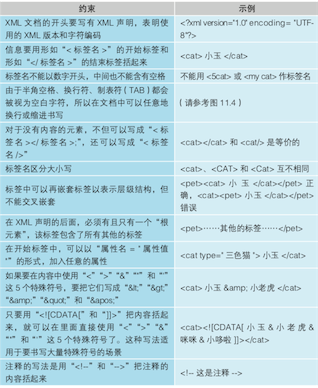

#### 4、计算机系统的构建者（SE）

1. SE（System Engineer）系统工程师的缩语。
2. 系统：由多个要素相互发生关联，结合而成的带有一定功能的整体。
3. 计算机系统：将各种各样的硬件和软件组合起来构成的系统就是计算机系统。
4. 计算机开发过程中的规范：瀑布模型。