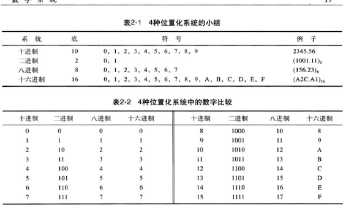

# 计算机科学导论-笔记

## 一、计算机发展历程

#### (一)计算机发展史

1. 计算和计算机的历史可分成三个阶段：
   1. 机械计算机阶段（1930以前）；
   2. 电子计算机阶段（1930–1950年）；
   3. 现代计算机阶段（1950至今）；
2. 图灵模型：
   1. 阿兰.图灵在1937年提出通用计算设备的设想，所有计算都可以在一种机器上执行，称为“图灵机”。
3. 冯.诺依曼模型
   1. 四个子系统：输入输出单元、算术逻辑单元、控制单元、存储单元。
   2. 冯.诺依曼模型将一台计算机定义为一台数据处理机。
   3. 冯.诺依曼模型指出程序必须存储在存储器中。

#### (二)计算机的组成

1. 计算机硬件。
2. 计算机软件。
3. 数据。

#### (三)计算机科学

1. 两大领域：系统领域、应用领域。
2. 系统领域：计算机系统结构、计算机网络、安全问题、操作系统、算法、程序设计及软件工程。
3. 应用领域：数据库、人工智能。

---

## 二、数据表示与运算（2、3、4章）

#### (一)数字系统

1. 数字系统的概念

   数字系统（或数码系统）是用独特的符号来表示数字的系统。

2. 数字系统分类：位置化系统、非位置化系统。

3. 十进制系统（以10位底）

   符号制：S= {0，1，2，。。。，9}。

4. 二进制系统（以2为底）

   1. S={0，1}；
   2. 逢二进一；

5. 十六进制（以16为底）

   1. S = {0，……，9，A，B，C，D，E，F}；

6. 八进制（以8为底）

   1. S = {0，1，.....，8}；

7. 进制转换

   1. 其他进制转成十进制：位数乘以底数再相加；
   2. 十进制转成其他进制：十进制整数连除以要转成的任意底，小数部分连乘；
   3. 其他进制转换：二进制转成十六进制，二进制的四位正好是十六进制的一位；二进制转换成八进制，二进制的三位是八进制的一位。

   实例：

   ​	（24）八进制转成等值的 （010 100）二进制

   ​	（24C）十六进制转成等值的 （0010 0100 1100）二进制

   ​	（1000111）二进制转成等值的（107）八进制（47）十六进制 （71）十进制	

8. 部分进制转换表

#### （二）数据存储

1. 

## 三、计算机硬件（5、6章）

## 四、计算机软件（7、8、9、10章）

## 五、数据组织与抽象（11、12、13、14章）

## 六、高级论题（15、16、17、18章）

